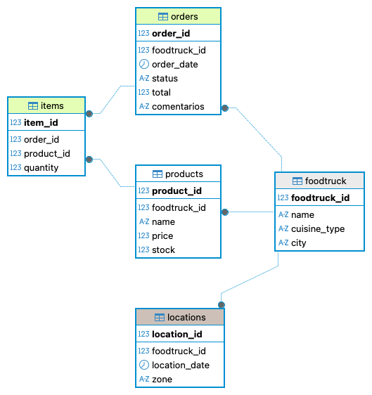

# FoodTrack DB

Plataforma para gestionar operaciones de foodtrucks en distintos puntos de una ciudad.

## Modelo relacional

El esquema está compuesto por 5 tablas:

- **foodtruck** → información de cada foodtruck (nombre, tipo de cocina, ciudad)
- **products** → productos que ofrece cada foodtruck (precio, stock)
- **orders** → pedidos realizados a un foodtruck (fecha, estado, total, comentarios)
- **items** → detalle de productos dentro de cada pedido
- **locations** → ubicaciones donde opera cada foodtruck

## Relaciones

- Un `foodtruck` tiene muchos `products`, `orders` y `locations`
- Un `order` tiene muchos `items`
- Un `item` referencia un `product`

